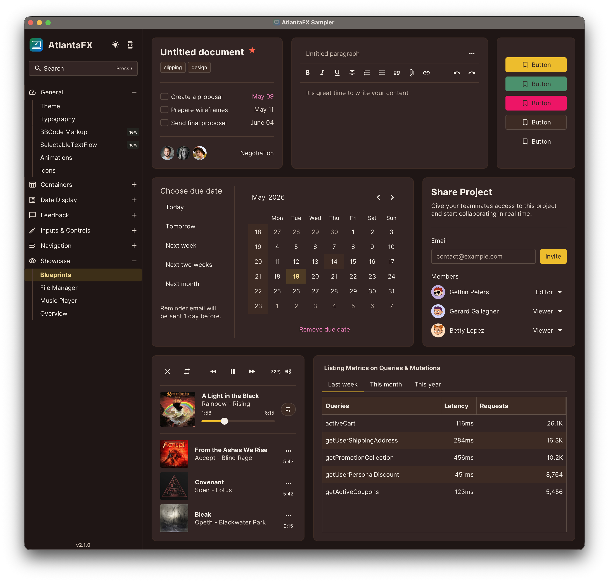
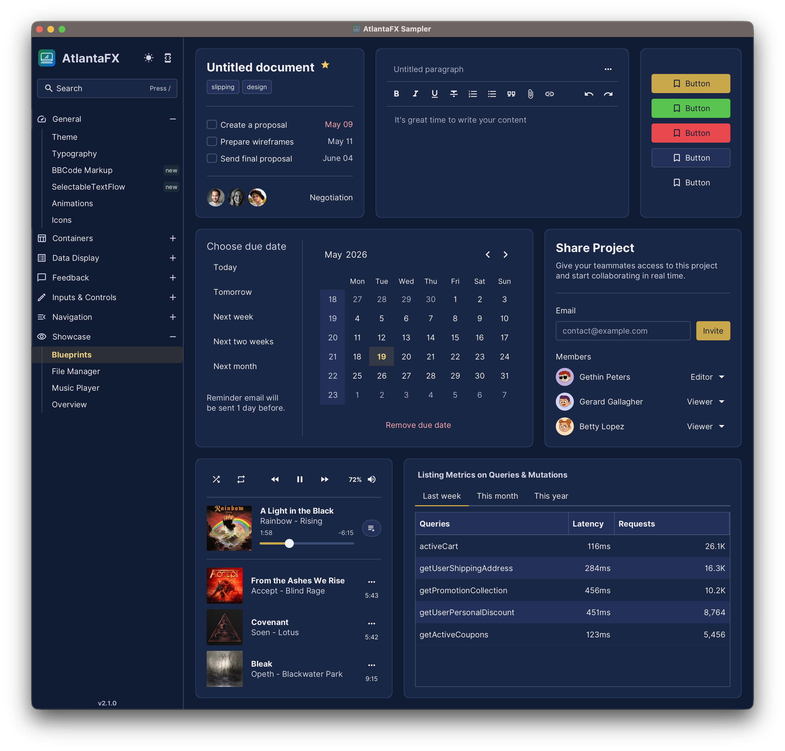
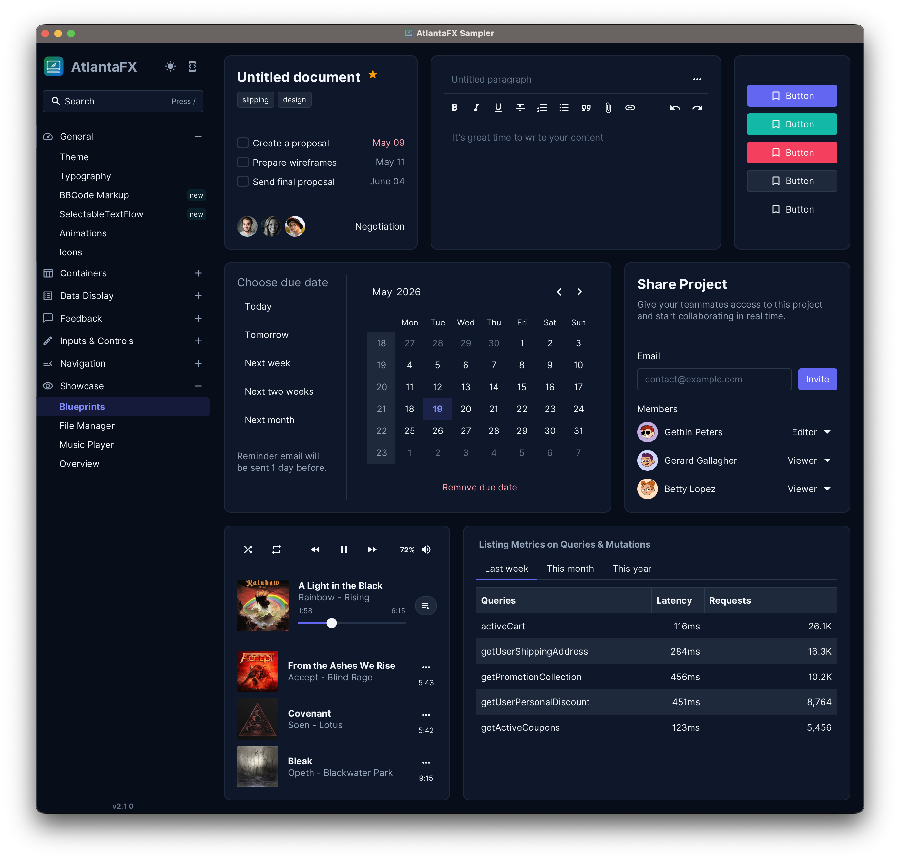

# AtlantaFX Themes

A collection of custom JavaFX CSS themes built on top of [AtlantaFX](https://github.com/mkpaz/atlantafx). Each theme is a standalone SCSS file that overrides AtlantaFX's color scale, functional color tokens, and dark/light mode flag — without touching the upstream stylesheet.

Clone the repository and use it as a starting point for your own theme.

## Themes

| File | Mode | Description |
|---|---|---|
| `browny.scss` | dark | Warm chocolate canvas, gold accent, hot-pink danger |
| `browny-light.scss` | light | Warm cream canvas, same gold and hot-pink palette |
| `navy.scss` | dark | Dark navy canvas, gold accent |
| `navy-light.scss` | light | White canvas, navy accent |
| `news.scss` | dark | Slate canvas, indigo accent, teal success |

Compiled CSS files are written to `src/main/resources/com/dlsc/atlantafx/themes/`.

## Build

```sh
mvn compile              # compile all themes
mvn compile -Pwatch      # watch mode — recompile on SCSS changes
```

The build unpacks the AtlantaFX SASS sources from the `atlantafx-styles` JAR into `target/` (via `maven-dependency-plugin`), then compiles each SCSS entry point with `sass-cli-maven-plugin`. The `target/` directory must exist before SCSS path references resolve correctly, so run `mvn compile` at least once before editing in watch mode.

## How to add a theme

1. Create `src/mytheme.scss` following the three-layer pattern:
   - `@forward .../settings/color-scale with (...)` — raw palette values
   - `@forward .../settings/color-vars with (...)` — semantic tokens mapped from the scale
   - `@forward .../settings/config with ($darkMode: true/false)`
   - `@use .../general` and `@use .../components`
2. Add a `<arg>` entry to the `sass-cli-maven-plugin` configuration in `pom.xml`.
3. Run `mvn compile`.

## Screenshots

### Browny (dark)


### Navy (dark)


### News (dark)

