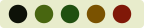
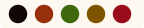
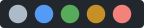
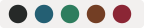

# AtlantaFX Themes

A collection of custom JavaFX CSS themes built on top of [AtlantaFX](https://github.com/mkpaz/atlantafx). Each theme is a standalone SCSS file that overrides AtlantaFX's color scale, functional color tokens, and dark/light mode flag — without touching the upstream stylesheet.

Browse and compare all themes at **https://dlsc-software-consulting-gmbh.github.io/atlantafx-themes/**

Clone the repository and use it as a starting point for your own theme.

## Themes


| File                           | Java class              | Mode  | Preview                                                            | Description                                                                                                                                   |
| ------------------------------ | ----------------------- | ----- | ------------------------------------------------------------------ | --------------------------------------------------------------------------------------------------------------------------------------------- |
| `army-dark.scss`               | `ArmyDark`              | dark  |                              | Dark olive canvas, olive drab neutral, tactical green accent, desert amber warning, forest green success, military red danger                 |
| `army-light.scss`              | `ArmyLight`             | light |                            | Light khaki canvas, olive drab neutral, tactical green accent, desert amber warning, forest green success, military red danger                |
| `autumn.scss`                  | `Autumn`                | dark  |                                    | Dark navy canvas, teal neutral, burnt orange accent, brick red danger, autumn gold warning, olive success                                     |
| `blacky.scss`                  | `Blacky`                | dark  |                                    | Pure black canvas, white foreground, amber accent, vivid red danger, golden yellow warning, bright green success                              |
| `blue-dark.scss`               | `BlueDark`              | dark  |                              | Blue dark theme — primary blue, brand red                                                                                                    |
| `blue-light.scss`              | `BlueLight`             | light |                            | Blue light theme — primary blue, brand red                                                                                                   |
| `browny.scss`                  | `Browny`                | dark  |                                    | Warm chocolate canvas, gold accent, hot-pink danger                                                                                           |
| `fall-dark.scss`               | `FallDark`              | dark  |                              | Deep mahogany canvas, warm amber neutrals, pumpkin orange accent, harvest gold warning, harvest green success, cranberry danger               |
| `fall-light.scss`              | `FallLight`             | light |                            | Warm cream canvas, brown-gray neutrals, rust sienna accent, harvest amber warning, harvest olive success, burgundy danger                     |
| `github-dark-colorblind.scss`  | `GithubDarkColorblind`  | dark  |    | GitHub Dark for Protanopia & Deuteranopia — orange danger, blue success                                                                      |
| `github-dark-tritanopia.scss`  | `GithubDarkTritanopia`  | dark  |    | GitHub Dark for Tritanopia — red danger, blue success                                                                                        |
| `github-light-colorblind.scss` | `GithubLightColorblind` | light |  | GitHub Light for Protanopia & Deuteranopia — orange danger, blue success                                                                     |
| `github-light-default.scss`    | `GithubLightDefault`    | light |        | GitHub Light Default palette (Primer light)                                                                                                   |
| `github-light-tritanopia.scss` | `GithubLightTritanopia` | light |  | GitHub Light for Tritanopia — red danger, blue success                                                                                       |
| `github-soft-dark.scss`        | `GithubSoftDark`        | dark  |                | GitHub Dark Dimmed palette (Primer dark_dimmed)                                                                                               |
| `navy-dark.scss`               | `NavyDark`              | dark  |                              | Dark navy canvas, gold accent                                                                                                                 |
| `navy-light.scss`              | `NavyLight`             | light |                            | White canvas, navy accent                                                                                                                     |
| `news.scss`                    | `News`                  | dark  |                                        | Slate canvas, indigo accent, teal success                                                                                                     |
| `spring-dark.scss`             | `SpringDark`            | dark  |                          | Deep forest night canvas, bright lime green neutrals, cherry blossom pink accent, firefly gold warning, lime green success, rose berry danger |
| `spring-light.scss`            | `SpringLight`           | light |                        | White canvas, sage green neutrals, cherry blossom rose accent, daffodil amber warning, spring green success, cherry red danger                |
| `summer-dark.scss`             | `SummerDark`            | dark  |                          | Deep tropical ocean canvas, sky blue neutrals, golden sunset accent, golden sun warning, tropical teal success, sunset coral danger           |
| `summer-light.scss`            | `SummerLight`           | light |                        | White canvas, sky blue-gray neutrals, ocean blue accent, sunflower amber warning, grass green success, sunburn coral danger                   |
| `winter-dark.scss`             | `WinterDark`            | dark  |                          | Deep midnight indigo canvas, ice blue neutrals, crystalline blue accent, aurora gold warning, aurora green success, aurora red danger         |
| `winter-light.scss`            | `WinterLight`           | light |                        | White canvas, silver-ice blue neutrals, deep indigo accent, spiced amber warning, pine green success, holly berry danger                      |
| `yacht.scss`                   | `Yacht`                 | light |                                      | Linen canvas, ocean teal accent, brass/rust warning, sea green success, maritime red danger                                                   |

Compiled CSS files are written to `src/main/resources/com/dlsc/atlantafx/themes/`.

## Build

```sh
mvn compile              # compile all themes
mvn compile -Pwatch      # watch mode — recompile on SCSS changes
```

The build unpacks the AtlantaFX SASS sources from the `atlantafx-styles` JAR into `target/` (via `maven-dependency-plugin`), then compiles each SCSS entry point with `sass-cli-maven-plugin`. The `target/` directory must exist before SCSS path references resolve correctly, so run `mvn compile` at least once before editing in watch mode.

## How to add a theme

1. Create `src/mytheme.scss` following the three-layer pattern:
   - `@forward .../settings/color-scale with (...)` — raw palette values
   - `@forward .../settings/color-vars with (...)` — semantic tokens mapped from the scale
   - `@forward .../settings/config with ($darkMode: true/false)`
   - `@use .../general` and `@use .../components`
2. Add a `<arg>` entry to the `sass-cli-maven-plugin` configuration in `pom.xml`.
3. Create a Java class in `src/main/java/com/dlsc/atlantafx/themes/` implementing `atlantafx.base.theme.Theme`.
4. Register the new class in the `provides` directive of `src/main/java/module-info.java` so the `ServiceLoader` and unit tests pick it up.
5. Run `mvn compile`.

## Applying a theme

Each theme ships with a ready-to-use `Theme` implementation (see the Java class column in the table above).
Pass it to `Application.setUserAgentStylesheet()` at startup:

```java
@Override
public void start(Stage stage) {
    Application.setUserAgentStylesheet(new NavyDark().getUserAgentStylesheet());
    // ...
}
```

## Examples

### Browny (dark)


### Navy (dark)


### News (dark)


